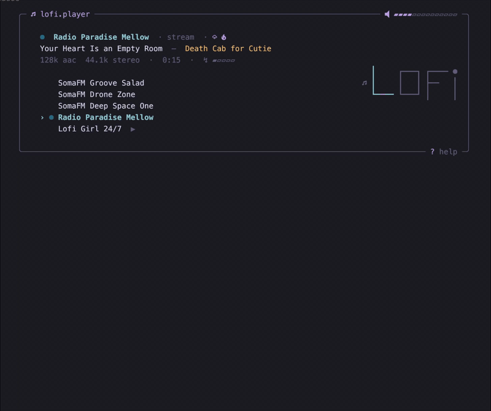

# lofi-player

[English](README.md) · **Русский**

TUI-плеер для лофи, чиллхопа и эмбиент-радио — управляется
с клавиатуры, спокойно живёт в tmux-панели пока ты работаешь.

[](https://github.com/iRootPro/lofi-player/actions/workflows/ci.yml)
[](https://github.com/iRootPro/lofi-player/releases)
[](go.mod)
[](LICENSE)

<p align="center">
  
</p>

## Что это

Маленький Go TUI поверх `mpv` — превращает его в удобный селектор
лофи-станций. Выбираешь поток, жмёшь space, оставляешь играть.
Можно подмешать дождь или треск камина из эмбиент-микшера.
Затягиваешь окно в tmux-панель и забываешь о нём.

Это **не** менеджер музыкальной библиотеки, не качалка и не Spotify.
Единственное, что он играет — интернет-радио (Icecast/Shoutcast,
прямые HTTP-потоки и YouTube-видео/трансляции через `yt-dlp`).

## Возможности

- **Интернет-радио** — любой URL, который умеет открывать `mpv`:
  Icecast, Shoutcast, прямой HTTP/HTTPS. SomaFM и Radio Paradise
  лежат в дефолтах.
- **YouTube-потоки** — Lofi Girl 24/7 и аналоги через mpv'шный
  `ytdl_hook` (нужен `yt-dlp`).
- **Эмбиент-микшер** — пять зацикленных дорожек (rain, fire, cafe,
  white noise, thunder), CC0-исходники, вшиты в бинарник. У каждого
  канала своя громкость, миксы накладываются под основную станцию.
- **Четыре темы** — Tokyo Night, Catppuccin Mocha, Gruvbox Dark,
  Rose Pine. Перебор по `t`.
- **Mini-режим** — сворачивает UI до ~6 строк, чтобы влезть в
  tmux-панель (`m`).
- **Tmux statusline** — `lofi-player --statusline` печатает одну
  цветную строку для `status-right`.
- **Сохранение состояния** — последняя станция, громкость, тема,
  уровни эмбиента переживают перезапуск (XDG state dir).
- **Управление станциями из TUI** — `a` добавляет, `e` редактирует,
  `d` удаляет (с подтверждением). Тип станции определяется по URL
  автоматически.
- **ICY-метаданные** — обновления title/artist из потока приезжают
  в карточку «сейчас играет».
- **Stream-info строка** — битрейт, кодек, частота дискретизации,
  uptime сессии и индикатор буфера сети живут под карточкой
  «сейчас играет». Переключение показа через `i`, выбор сохраняется
  между запусками.
- **Дружелюбный первый запуск** — если `mpv` не установлен, ты
  увидишь красивую карточку с командами установки вместо сырой
  ошибки; если `yt-dlp` нет — стартап-варнинг и тег `unavailable`
  у YouTube-станций, остальная библиотека продолжает играть.

## Установка

Поддерживаемые платформы: `linux/amd64`, `linux/arm64`,
`darwin/amd64`, `darwin/arm64`. Windows не поддерживается.

### Homebrew (macOS, Linux) — рекомендую

```sh
brew install iRootPro/tap/lofi-player
```

Формула сама подтянет `mpv` и предложит `yt-dlp` для YouTube — одна
команда и всё готово.

### Однострочный инсталлер (macOS, Linux)

```sh
curl -fsSL https://raw.githubusercontent.com/iRootPro/lofi-player/main/scripts/install.sh | sh
```

Сам определяет OS/arch, скачивает архив из последнего релиза, кладёт
бинарник в `~/.local/bin`. Переопределить можно через
`INSTALL_DIR=/usr/local/bin`, заПинить версию — через `VERSION=v0.1.2`.

`mpv` (и опционально `yt-dlp`) поставь отдельно — см.
[системные зависимости](#системные-зависимости) ниже. Инсталлер
напишет подсказку если `mpv` не на `$PATH`.

### Из исходников (Go 1.26+)

```sh
go install github.com/iRootPro/lofi-player@latest
```

### Готовые бинарники

Возьми архив для своей OS/arch со
[страницы релизов](https://github.com/iRootPro/lofi-player/releases),
распакуй, положи `lofi-player` куда-нибудь в `$PATH`.

### Системные зависимости

Homebrew ставит их за тебя. Остальные пути установки требуют
поставить руками.

| зависимость | для чего | установка |
|---|---|---|
| `mpv` | всё воспроизведение | `brew install mpv` · `apt install mpv` · `pacman -S mpv` · `dnf install mpv` |
| `yt-dlp` | только для YouTube-станций | `brew install yt-dlp` · `pip install yt-dlp` |
| Nerd Font | иконки в шапке/громкости/микшере | [JetBrains Mono](https://github.com/ryanoasis/nerd-fonts/releases) или [FiraCode](https://github.com/ryanoasis/nerd-fonts/releases) Nerd Font |

Если `mpv` не на `$PATH`, приложение нарисует стилизованную карточку
«can't start» с командами установки под твою платформу и выйдет —
без движка играть нечем. Если в конфиге есть YouTube-станции, а
`yt-dlp` нет — приложение стартует, показывает варнинг тостом,
помечает YouTube-строки как `unavailable` и отказывается их играть;
прямые потоки работают как обычно. Без Nerd Font иконки рендерятся
как «коробочки», но остальной UI работает.

## Быстрый старт

```sh
lofi-player
```

При первом запуске в `~/.config/lofi-player/config.yaml` записывается
дефолтный конфиг с четырьмя станциями SomaFM/Radio Paradise. Выбери
станцию `j`/`k`, нажми `space`, утащи окно в tmux-панель, возвращайся
к работе.

Выход — `q` или `ctrl+c`.

## Горячие клавиши

### Глобальные

| клавиша | действие |
|---|---|
| `j` / `↓` | курсор вниз |
| `k` / `↑` | курсор вверх |
| `space` | play / pause выбранной станции |
| `+` / `=` | громкость +5% |
| `-` / `_` | громкость -5% |
| `t` | следующая тема |
| `m` | переключить mini-режим |
| `a` | добавить станцию (модалка) |
| `e` | редактировать выбранную станцию (модалка) |
| `d` | удалить выбранную станцию (с подтверждением) |
| `x` | открыть эмбиент-микшер (модалка) |
| `i` | переключить stream-info строку |
| `?` | показать/скрыть полную справку |
| `q` / `ctrl+c` | выход |

### Эмбиент-микшер (после `x`)

| клавиша | действие |
|---|---|
| `j` / `↓` · `k` / `↑` | выбрать канал |
| `h` / `←` · `l` / `→` | громкость ±5% (мелкий шаг) |
| `H` · `L` | громкость ±25% (крупный шаг) |
| `0` | mute канала |
| `1` | канал в 100% |
| `esc` / `x` | закрыть микшер (состояние сохраняется автоматически) |

### Добавление / редактирование станции (после `a` или `e`)

| клавиша | действие |
|---|---|
| `tab` / `shift+tab` | следующее / предыдущее поле |
| `enter` | сохранить (запись в `config.yaml`) |
| `esc` | отмена |

`e` подставляет в форму имя и URL выбранной станции; `enter`
обновляет её на месте. `kind` определяется из URL автоматически:
`youtube.com` / `youtu.be` → `youtube`, всё остальное → `stream`.

### Подтверждение удаления (после `d`)

| клавиша | действие |
|---|---|
| `y` / `enter` | подтвердить удаление |
| `n` / `esc` | отмена |

Удаление сейчас играющей станции ставит воспроизведение на паузу и
очищает карточку «сейчас играет». Изменение пишется в `config.yaml`
сразу.

## Конфигурация

Лежит в `$XDG_CONFIG_HOME/lofi-player/config.yaml` — то есть
`~/.config/lofi-player/config.yaml` и на Linux, и на macOS. Создаётся
при первом запуске с разумными дефолтами; задокументированный пример —
в [`configs/lofi-player.example.yaml`](configs/lofi-player.example.yaml).

```yaml
theme: tokyo-night        # tokyo-night | catppuccin-mocha | gruvbox-dark | rose-pine
volume: 60                # стартовая громкость, 0–100

stations:
  - name: SomaFM Groove Salad
    url: https://ice1.somafm.com/groovesalad-256-mp3

  - name: Lofi Girl 24/7
    url: https://www.youtube.com/watch?v=jfKfPfyJRdk
    kind: youtube         # нужно только для YouTube-URL
```

Хочется больше станций «из коробки»? В
[`configs/radiopotok.yaml`](configs/radiopotok.yaml) лежит готовый
пресет на ~200 chillout / jazz / classical / trance потоков с
[radiopotok.ru](https://radiopotok.ru) — скопируй понравившиеся
записи в свой `config.yaml`. Перегенерировать пресет с upstream
можно через `./scripts/fetch-radiopotok.py`. Около 20% этих
сторонних потоков в любой момент могут не работать; просто выбери
другую если одна упала.

## Темы

В бинарник встроены четыре палитры:

- **Tokyo Night** (по умолчанию) — холодная, неон по тёмно-синему.
- **Catppuccin Mocha** — пастель по тёплому угольному.
- **Gruvbox Dark** — землистая, контрастная.
- **Rose Pine** — приглушённая, мягкая мауве.

Перебор вживую по `t`. Выбор сохраняется в state и применяется при
следующем запуске.

## Mini-режим и tmux

`m` сворачивает UI до одной только карточки «сейчас играет» —
примерно шесть строк. Закидываешь окно в маленькую tmux-панель и
получаешь постоянную «что играет» — поверхность.

Для ещё более компактного следа есть режим `--statusline`: печатает
одну цветную строку и выходит, удобно для `status-right`:

```sh
lofi-player --statusline
# ♪ SomaFM Drone Zone  ▰▰▰▱▱▱  60%
```

```tmux
set -g status-interval 5
set -g status-right '#(lofi-player --statusline)'
```

## Состояние

`$XDG_STATE_HOME/lofi-player/state.json` — то есть
`~/.local/state/lofi-player/state.json` на Linux и macOS. Хранит
последнюю тему, громкость, имя станции и громкости каждого
эмбиент-канала. Best-effort: ошибка записи логируется в stderr, но
не прерывает завершение приложения.

## Структура проекта

```
main.go                      entry: load config + state, start mpv, run TUI
internal/
  audio/                     mpv subprocess + JSON-IPC client + ambient mixer
  config/                    YAML config + XDG paths + defaults
  state/                     state.json — last-session persistence
  theme/                     color palettes
  tui/                       Bubble Tea model / update / view / keys / styles
configs/
  lofi-player.example.yaml   documented example config
  radiopotok.yaml            ~200-station preset
scripts/
  fetch-radiopotok.py        regenerates configs/radiopotok.yaml
demo/
  lofi-player.tape           vhs script for the README GIF
plans/
  lofi-player-plan.md        roadmap (single source of truth)
```

## Сборка и тесты

```sh
go build -o lofi-player .
go test  ./...
go vet   ./...
```

Workflow без Makefile — это сознательно. Релизы делаются локально:
`git tag -a vX.Y.Z -m "..."` потом `goreleaser release --clean` —
goreleaser сразу загружает бинарники в GitHub Releases и пушит
обновлённую формулу в [iRootPro/homebrew-tap](https://github.com/iRootPro/homebrew-tap).
CI на `main` гоняет `vet` + `test` + `build` на каждый push.

## Кредиты

Эмбиент-сэмплы — CC0 (public domain), кредиты здесь как любезность
и чтобы оригиналы можно было найти.

| канал | источник | автор |
|---|---|---|
| rain | [freesound.org/s/525046](https://freesound.org/s/525046/) | speakwithanimals |
| fire | [freesound.org/s/760474](https://freesound.org/s/760474/) | True_Killian |
| white noise | [freesound.org/s/132275](https://freesound.org/s/132275/) | assett1 |
| cafe | [freesound.org/s/32910](https://freesound.org/s/32910/) | ToddBradley |
| thunder | [freesound.org/s/717890](https://freesound.org/s/717890/) | TRP |

Построено на [Bubble Tea](https://github.com/charmbracelet/bubbletea),
[Lipgloss](https://github.com/charmbracelet/lipgloss),
[Bubbles](https://github.com/charmbracelet/bubbles) и
[mpv](https://mpv.io/).

## Лицензия

MIT — см. [LICENSE](LICENSE).
